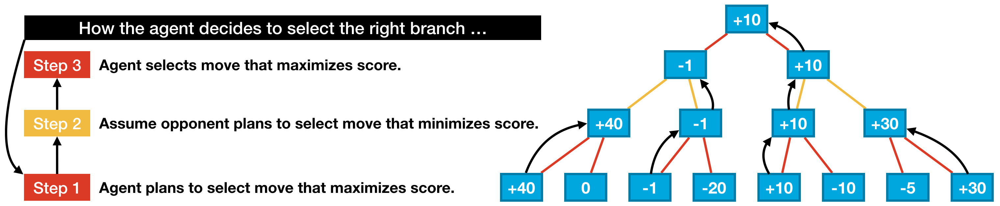

# ConnectFour

Connect Four is a game where two players alternate turns dropping colored discs into a vertical grid. Each player uses a different color (usually red or yellow), and the objective of the game is to be the first player to get four discs in a row.
 

To create a game UI, I followed a Kaggle.com tutorial on Game AI and Reinforcement Learning

